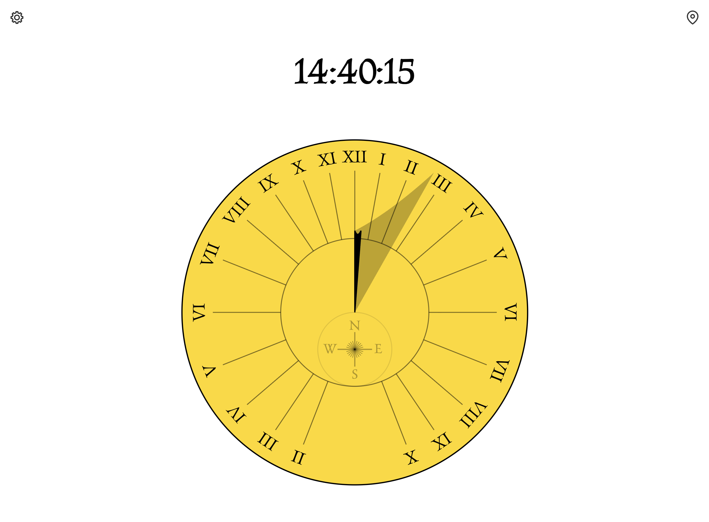
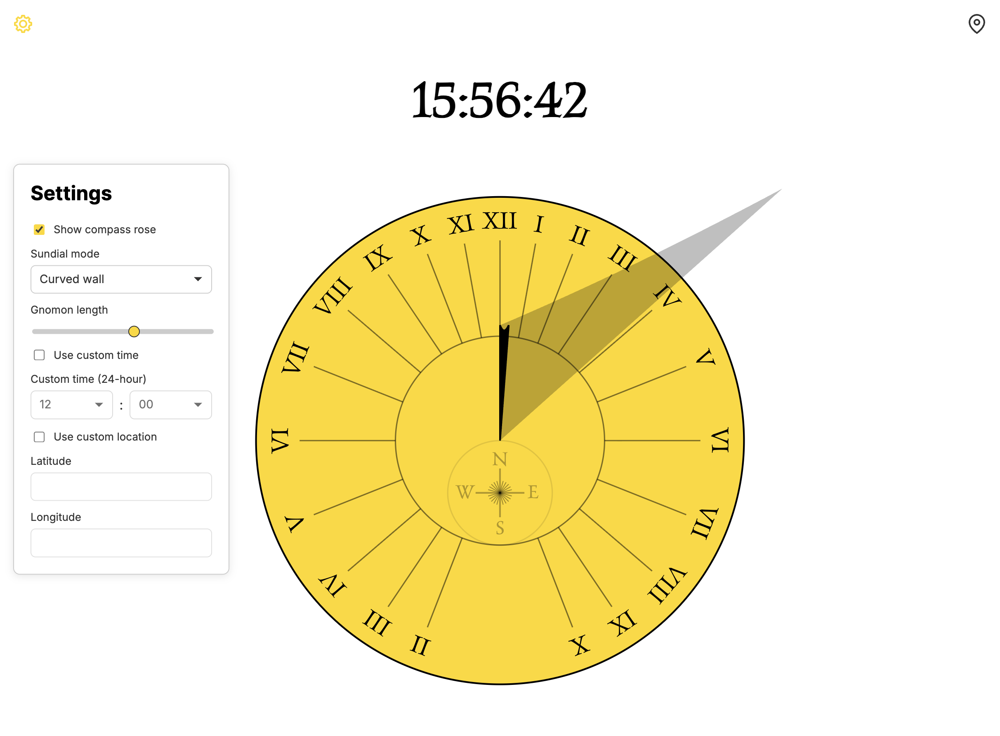

Assignment 1 - Hello World: GitHub and d3  
===

### Description

In this project, I created a sundial visualization using d3.js. The sundial displays the current time based on the position of the sun, with hour lines and a gnomon casting a shadow. The visualization is interactive (in that you can select your location and configure aspects of the sundial) and updates in real-time to reflect the changing position of the sun throughout the day.

Minimum requirements met:
- The sundial includes multiple circles (the main face and compass rose)
- Rectangles are used for the compass rose
- Lines are used for the hour lines, and one version of the gnomon and shadow
- Polygons are used for the gnomon and shadow in another version
- Paths are used for the gnomon and shadow in another version

- Gold is the primary color used, but there are different opacities of black for various elements to build an aesthetic contrast. This usage was approved by Prof. Lane on Slack.

This is what the settings panel looks like:

### Live Link

You can view the live sundial visualization at the following URL:

https://weavergoldman.com/a1-ghd3/

It is automatically deployed to GitHub pages on each commit to the main branch, via GitHub Actions.

### Technical Achievements

For the technical achievements, I implemented the following features:

- Real-time updating of the sundial based on the current time and date.
  - This involved calling an update function based on different sundial equations inside of the requestAnimationFrame loop.
- Calculation of the sun's position based on the user's latitude and longitude.
  - This involves getting permissions to access the user's location via the browser's Geolocation API.
- Interactive settings panel that allows users to customize the sundial's appearance and functionality, including:
  - Toggling the visibility of hour lines, gnomon, and shadow.
  - Choosing between different representations of the gnomon and shadow (line, polygon, path).
  - Showing an hiding the compass rose.
  - Setting custom time or location.
- Responsive design to ensure the sundial displays correctly on various screen sizes.
- Used GitHub Actions to automate deployment to GitHub Pages on each commit to the main branch.

### Design Achievements

For the design achievements, I focused on creating an aesthetically pleasing and user-friendly sundial visualization:

- Used a gold and black color scheme to evoke the traditional look of sundials while ensuring good contrast for visibility.
- Used Roman numerals and a serif font for the hour markers to enhance the classic sundial appearance.
- Designed a clean and intuitive settings panel that allows users to easily customize the sundial without cluttering the main visualization.
- Carefully utilized different shades of black with varying opacities to create depth and visual interest without overwhelming the primary gold color.
- Referenced historical sundial designs to inform the layout and style of the visualization, ensuring it felt authentic while still being modern and interactive.
- Added a gnomon with the appearance of depth, which most online alternatives seem to lack.

### Sundial Research

I used the following sources to research sundials, their mathematics, and existing online implementations:

- https://sundials.org/index.php/teachers-corner/sundial-mathematics
- https://files.eric.ed.gov/fulltext/EJ802706.pdf
- https://sun.cenoss.com/sundial/sundial01-e.html
